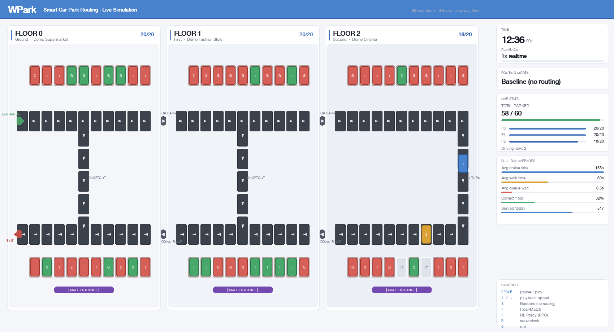
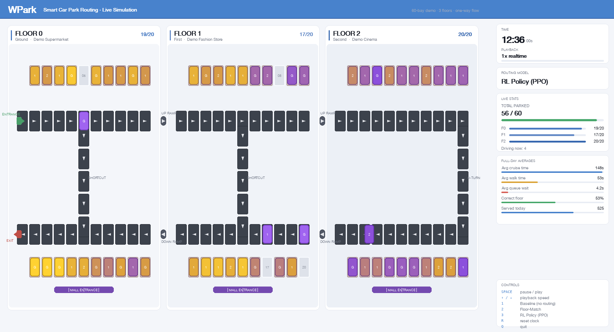
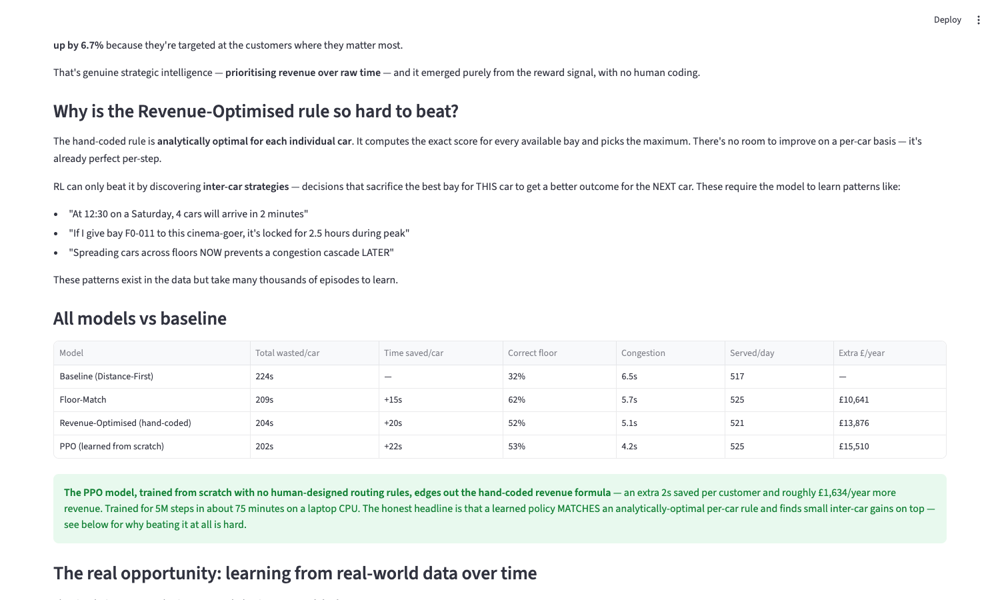

# WPark Smart Car Park Routing

Physics simulation of a multi-storey car park, plus routing policies that decide which bay each arriving car should get.
Built during a 4-day sprint at Cambridge Judge Business School with WPark, then hardened afterwards (tests, a regenerated study - see DECISIONS.md #10).

A hand-coded revenue-optimal rule is the baseline to beat; a MaskablePPO agent trained from scratch beats it by a small but statistically solid margin.


*Baseline (no routing) at lunchtime peak: cars park at the first empty bay, so most end up on the wrong floor for their shop (red = wrong floor, green = right floor). 32% correct floor.*


*The PPO policy on the identical day, coloured by revenue value of each assignment (purple = low, gold = high). It routes short-stay, high-spend customers to premium bays: less walking, less queueing, more revenue.*

## The problem

In the baseline simulation, 68% of shoppers park on the wrong floor for the shop they came for, and every wrong floor costs about 45 seconds of stairs.
Time a customer spends driving, queueing, parking, and climbing stairs is time they are not spending in shops.
If the car park knows the customer's destination (from a parking app booking or ticket choice), it can route them better.

## How it works

**The simulator is a cellular automaton.**
Every lane is a chain of discrete cells; each cell holds at most one car; a car advances only if the next cell is empty.
Parking blocks the lane behind the car for the full 45-second manoeuvre.
Congestion therefore emerges from the physics - there are no tuned congestion parameters, and overtaking is impossible by construction.
The engine simulates every second of an 18-hour day for a 60-bay, 3-floor demo garage (a parametric variant scales to 180 bays).

**The reward is revenue, not time.**
Each assignment is scored as `time saved x 0.6 dwell-to-spend conversion x shop spend rate / visit minutes`.
The division by visit minutes is the interesting part: a second saved for a 30-minute grocery shopper is worth more than one saved for a 2.5-hour cinema-goer.
The 0.6 conversion comes from published UK mall research (Dennis et al. 2002; Underhill 1999; published range 0.5-0.85, we use the conservative end).

**Four policies compete on identical customer streams:**

1. **Baseline** - park in the first available bay (with 10% driver noise). No routing.
2. **Floor-Match** - send the car to its destination floor, nearest bay first.
3. **Revenue-Optimised** - the exact per-car argmax of the reward function. This is the analytic optimum for each individual decision, so it is the strongest fair baseline: RL can only beat it through inter-car strategy.
4. **PPO** - MaskablePPO (stable-baselines3), 25-dim state, 60 masked actions, trained from scratch for 5M steps (~75 min on a laptop CPU). No warm start, no imitation.

## Results

1,000 simulated days per policy, paired seeds (every policy faces identical customers), paired t-tests.
All deltas below are significant at p < 0.001, including PPO vs Revenue-Optimised.
Full per-run data: [results/combined_4policy_1000.csv](results/combined_4policy_1000.csv). Regenerate with `python run_baseline_study.py`.

| Policy | Wasted time/car | Saved vs baseline | Queue wait | Correct floor | Extra revenue/year |
|---|---|---|---|---|---|
| Baseline | 223.7s | - | 7.3s | 33% | - |
| Floor-Match | 207.8s | 15.9s | 6.3s | 63% | £10,976 |
| Revenue-Optimised | 205.9s | 17.9s | 4.8s | 52% | £11,874 |
| **PPO** | **200.4s** | **23.3s** | **3.9s** | **55%** | **£16,336** |

The PPO agent beats the analytic per-car optimum by 5.5s per car (t = 75, n = 1000).
Since the hand-coded rule is already perfect per decision, that margin is evidence of learned inter-car strategy: the agent sacrifices individual assignments to protect later, more valuable ones, and its queue waits are the lowest of all four policies.

Notes on honesty: the 68% wrong-floor figure is the simulator's own baseline output under synthetic demand (see Known limitations below), not an industry statistic.
At peak demand the 60-bay park saturates and turns away ~28% of arrivals under every policy; the comparison above is therefore about serving the same customers better, not serving more of them.


*The Streamlit dashboard's model comparison, computed live from a single seeded run.*

## Running it

```bash
git clone https://github.com/BVarvill/wpark-smart-routing.git
cd wpark-smart-routing
python3 -m venv .venv && source .venv/bin/activate
pip install -r requirements.txt

cd simulation
python demo_pygame.py            # live animated simulation (keys: 1/2/3 switch policy, SPACE pause)
python compare_policies.py       # single-day comparison of all four policies
python run_baseline_study.py     # the full 1000-run study (~10 min)
python train_ppo.py --steps 5000000   # retrain PPO from scratch (~75 min CPU)
streamlit run webapp.py          # dashboard

cd .. && python -m pytest tests/   # test suite
```

The trained model ships in the repo (`simulation/models/ppo_policy.zip`), so the demo and comparisons work immediately.
If the model fails to load, the engine logs an error and falls back to the hand-coded rule - loudly, because a silent fallback here once mislabelled greedy results as PPO results (DECISIONS.md #10).

## Known limitations

These are documented in detail in [DECISIONS.md](DECISIONS.md), which records every significant design choice and the alternatives rejected.

- **The training environment omits congestion.** Training uses a fast booking-table approximation so 5M steps stay cheap; congestion only exists in the evaluation simulator. The agent cannot learn congestion avoidance from a reward that never contains it - fixing this (training inside the cellular sim) is the top roadmap item.
- **Train/serve feature skew.** At inference time a few state dimensions are occupancy-derived proxies for histories the engine does not track. Documented in `engine.py`.
- **Demand is hand-authored, not fitted to real data.** Both the arrival-rate curve and the length-of-stay distribution used in every committed script are synthetic (a bell curve and three normal-distributed stay-length clusters), written by hand for a clean demo rather than fit to the real Cambridge dataset. `demand.py` includes loaders that can build a demand profile with real arrival rates and real stay lengths from that dataset, but the raw files are WPark's and aren't distributed, so no committed entry point uses them by default.
- **Time saved is assumed to convert into spend.** The reward assumes a customer who saves T seconds of parking and walking spends 0.6 x T extra seconds shopping. The 0.6 figure is cited (see above), but the underlying mechanism - that freed-up minutes become shopping minutes rather than an earlier departure - is a modelled assumption, not something this simulation or the source dataset (which recorded parking events, not till receipts) can verify.

## Repository layout

```
simulation/
  carpark.py            geometry + cellular lane model (60-bay demo, parametric scaled, Car Park A)
  engine.py             discrete-event engine + the four routing policies
  demand.py             demand profiles (synthetic + loaders for the real-data format)
  rl_env.py             RL environment (step per arriving car)
  train_ppo.py          MaskablePPO training
  demo_pygame.py        live animated demo
  webapp.py             Streamlit dashboard
  compare_policies.py   single-day policy comparison
  run_baseline_study.py 1000-run statistical study
  sim_results.py        business-case arithmetic (all constants cited here)
  models/ppo_policy.zip trained PPO model (5M steps)
results/
  combined_4policy_1000.csv   the full study behind the results table
tests/                  physics invariants, determinism, reward maths, PPO regression
DECISIONS.md            design decisions + rejected alternatives
```

## License

MIT - see [LICENSE](LICENSE).
